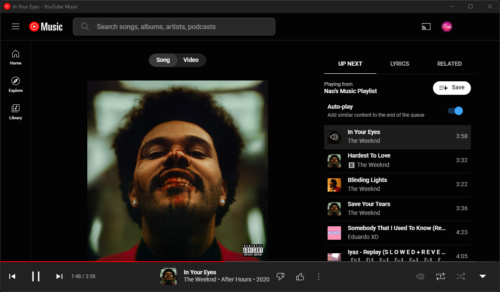

# YouTube Music

⭐ Star me on GitHub - it motivates me a lot!

YouTube Music is your all-in-one music companion, designed to revolutionize the way you experience and interact with music. With a seamless blend of cutting-edge features and intuitive design, this app offers a comprehensive music playback experience like no other. I made this because YouTube is too lazy to make their own app, consider this the official un-official app for YouTube Music.

### How to download:
The latest version of the project can be downloaded [here](https://github.com/iTzNao/YouTube-Music/releases/latest).

### Key Features:

1.  **Music Playback:** Immerse yourself in a world of endless music possibilities. YouTube Music offers a vast library of songs spanning across genres, ensuring you find the perfect track for any moment.
    
2.  **Playlists:** Create personalized playlists tailored to your mood, activity, or occasion. Effortlessly curate and manage your music collections for every situation life throws at you.
    
3.  **Accounts:** Seamlessly connect your existing YouTube account to access your favourite playlists, liked videos, and subscriptions. Stay in control of your music experience with a personalized account.
    
4.  **Discord Status Integration:** Let your friends know what you're jamming to. Integrate your YouTube Music with Discord to display your current track, showcasing your musical taste in real-time.
    
5.  **Song Discovery:** Unearth hidden musical gems with our powerful recommendation engine. Discover new artists, albums, and tracks based on your listening history and preferences.
    
6.  **Multi-Media Key Compatibility:** Take charge of your music effortlessly. Utilize your device's multimedia keys to play, pause, skip, and adjust the volume without the need to switch between apps.

7.  **OBS / Streamlabs OBS Compatibility:** Ensure that your videos and streams can hear your music, and what you chose, nothing else.

### License

This project is licensed under the [BSD-3-Clause license] - see the [LICENSE](LICENSE) file for details.
